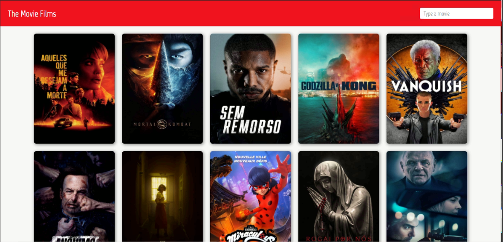
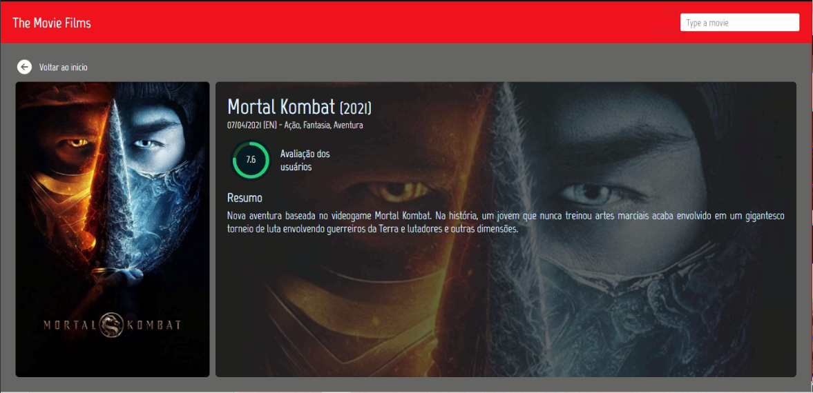

# The Movie films
- Aplicação utiliza os dados disponibilizados na API do TMDB <https://www.themoviedb.org/documentation/api>.

## Funcionalidades
- Listagem dos filmes mais populares ao abrir a página
- Paginação (ao descer a página vai carregando mais filmes)
- Ao digitar no campo de busca, é carregado os filmes na página
- Técnica debounce no campo de pesquisa
- Layout construído com grid layout
- Implementados alguns testes unitários (jest e @testing-library)

## Resulado

### Home page

### Details page
